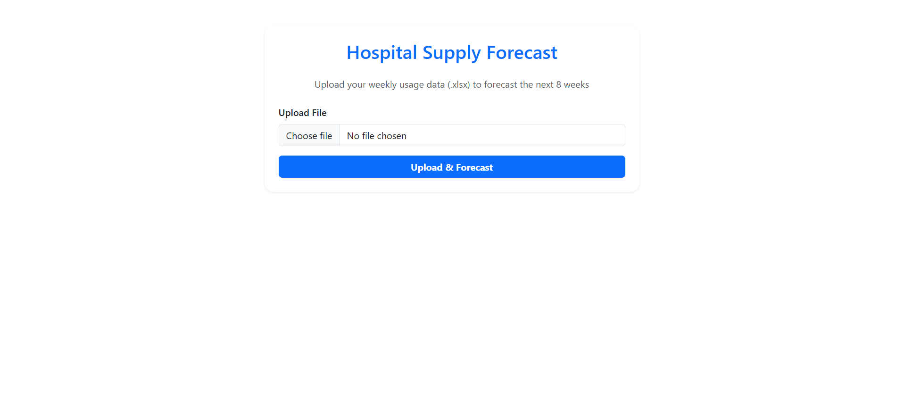
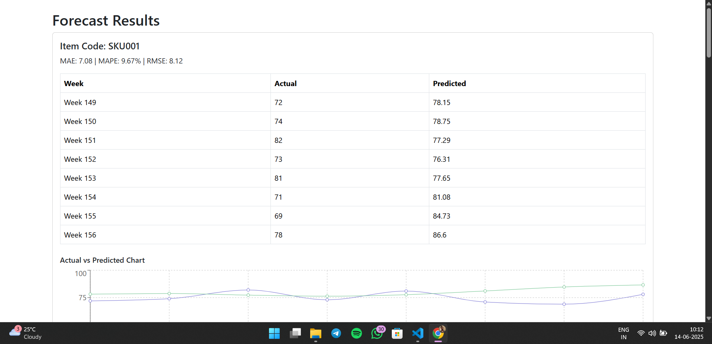

🏥 Hospital Supply Demand Forecasting

This application enables hospital staff to upload weekly usage data and forecast demand for various medical supplies using time series analysis with Facebook Prophet.

---

## 📦 Project Structure

hospital-supply-forecast/
├── client/ # Frontend (React + Bootstrap)
├── server/ # Backend (Node.js + Python model)
└── SREEJITH_README.md

---

## 🚀 Features

- 📤 Upload Excel with weekly supply usage data
- 🤖 Forecast next 8 weeks using Prophet time series model
- 📊 View Actual vs Predicted demand
- 📈 Display forecast accuracy (MAE, MAPE, RMSE)

---

## 🛠️ Tech Stack

| Layer       | Tech Used                    |
| ----------- | ---------------------------- |
| Frontend    | React.js, Bootstrap          |
| Backend     | Express.js, Python (Prophet) |
| File Upload | Axios, FormData              |

---

## 🔧 Setup Instructions

1. Clone the Repository

2. Backend Setup
   cd server

# Create virtual environment

    python -m venv venv

# Activate it

    venv\Scripts\activate

# Install Python dependencies

    pip install -r requirements.txt

# Install Node.js backend dependencies

    npm install

# Start the Express backend (runs on port 5000)

    npm run dev

3. Frontend Setup

   cd ../client

# Install React dependencies

    npm install

# Start the React app (usually on port 5173)

    npm run dev

# Testing the App

    - Open your browser at http://localhost:5173
    - Upload an Excel file with required columns (like Item_Code, Quantity_Used, etc.)
    - Click “Upload and Forecast”
    -View prediction table and metrics

📁 Example Data Format
Item_Code Quantity_Used Patient_Footfall Last_Week_Usage Public_Holiday Rain_Impact
ITEM001 24 120 20 0 1

📊 Sample Screenshot of the pages

📌 Notes
Ensure Python and Node.js are installed before setup.

The backend calls model_run.py to execute forecasting logic.

Interactive plots can be added using Plotly in the future.

🙌 Author
Sreejith — B.Tech CSE Graduate | MERN + Python Developer
